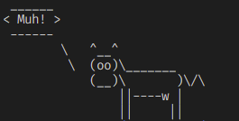
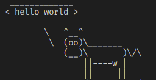
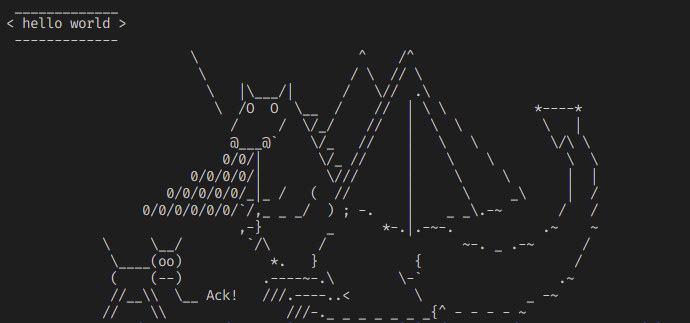
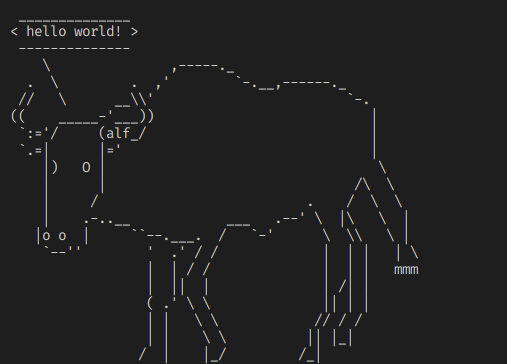

> # Docker
## Let's make the *Cowsay*
If you have Docker in your machine, you can clone this repository and build an image from the Dockerfile.<br>
#### 1. In your terminal run the command: 
```javascript
docker build -t my-container .
``` 
⚠️ **Obs.**: instead of "*my-container*", you can name the container as you like.

Now you may have an image built from [chuanwen/cowsay](https://hub.docker.com/r/chuanwen/cowsay).
#### 2. To run the container you just build, run the command:
```javascript
docker run my-container
``` 
 
#### 3. To make the cow say any phrase of your choice, you can write anything after the container name:
```javascript
docker run my-container hello world
```
  
#### 4. If you would like to see the animals or characters available, run the command:
```javascript
docker run my-container -l
```
#### 5. If you would like to make another character or animal say any phrase of you choice, it's just as the step 3, instead you will have to put it's name before the phrase:
```javascript
docker run my-container -f dragon-and-cow hello world
```


```javascript
docker run my-container -f gnu hello world
```


